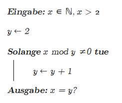

# Assignment 2

## 5)

### a)

 1. Ja
 2. Ja, es fehlt jedoch ein zweiter Wert, da `-` ein Operand ist der zwei eingaben benötigt
 3. Nein, Siehe 2
 4. Nicht direkt, die Klammer muss geschlossen werden
 5. Nein, das doppelte von x sollte mit `2 * x` ausgedrückt werden
 6. Ja
 7. Ja
 8. Nein, der Modulo operand benötgt 2 parameter vom typ int
 9. `1`
 10. `-2,3333...`
 11. `32 (SPACE)`
 12. `32 (SPACE)`
 13. `7  (BEL)`
 14. `2  (STX)`
 15. `12` (Anzahl der ausgegebenen Bytes)
 16. `1`
 17. `4`
 18. `5`
 19. `1`
 20. `3`

## 6)

### a)

````c
#include <stdio.h>
#include <ctype.h>

int main (void)
{
  char eingabe1, eingabe2;

  printf("Bitte geben Sie zwei Zeichen durch ein Leerzeichen separiert ein: ");
  scanf("%c %c", &eingabe1, &eingabe2);

  /* folgender code hätte das gleiche ergebnis, wäre aber unsauberer
   * printf("%i\n", isdigit(eingabe1) && isdigit(eingabe2));
   * hier wird der boolische rückgabewert zu einer ganzzahl umgewandelt.
   */

  if (isdigit(eingabe1) && isdigit(eingabe2)) {
    printf("1\n");
  } else {
    printf("0\n");
  }

  return 0;
}

````

### b)

````c
#include <stdio.h>
#include <ctype.h>

int main (void)
{
  char eingabe;
  printf("Bitte geben Sie ein Zeichen ein: ");
  scanf("%c", &eingabe);

  /* das if statement eigentlich unnötig, da tolower nur uppercase buchstaben
   * verändert. Demnach hätte
   * printf("%c", tolower(eingabe))
   * das gleiche ergebnis.
   */

  if (isupper(eingabe)) {
    printf("%c\n", tolower(eingabe));
  } else {
    printf("%c\n", eingabe);
  }

  return 0;
}

````

### c)

````c
#include <stdio.h>
#include <math.h>

int main (void)
{
  double bruch;

  printf("Bitte geben Sie einen Dezimalbruch ein:");

  scanf("%lf", &bruch);

  printf("%.0f\n", ceil(bruch));

  return 0;
}

````

### d)

````c
#include <stdio.h>
#include <math.h>

int main (void)
{
  double bruch;

  printf("Bitte geben Sie einen Dezimalbruch zwischen -1 und 1 ein: ");

  scanf("%lf", &bruch);

  printf("Arcus Sinus von %.2f ist %.4f\n", bruch, asin(bruch));

  return 0;
}

````

## 7)

### a)

**i)**

|1.     |2.     |3.     |4.     |
|-------|-------|-------|-------|
|k=0    |       |       |       |
|21 > 6?|15 > 6?|9 > 6? |3 > 6? |
|x=14   |x=8    |x=2    |       |
|k=1    |k=2    |k=3    |       |
|       |       |       | 3     |


**ii)**

Ganzzahlige Division (x enthält den Rest, wird aber nicht zurückgegeben)


### b)

````c
#include <stdio.h>

int comp (int dividend, int divisor)
{
  int quotient = 0;

  while (dividend + 1 > divisor) {
    dividend = dividend - divisor;
    quotient++;
  }

  return quotient;
}

int main (void)
{
  int x, y;
  printf("Bitte geben Sie zwei positive ganze Zahlen ein\n");
  printf("(getrennt durch ein Leerzeichen):\n");
  scanf("%i %i", &x, &y);

  printf("comp(%i, %i) = %i\n", x, y, comp(x, y));

  return 0;
}

````

### c)



### d)

````c
2001: INIT      3000
2002: SPRUNG    1000, 2009
2003: INIT      1001
2004: ADD       1001, 1000
2005: ADD       1001, 1000
2006: ADD       3000, 1001
2007: DEKREMENT 1000
2008: SPRUNG    2002
2009: AUSGABE   3000

/* Angenommen AUSGABE beendet das Program (wie return)
   lässt sich ein befehl einsparen */

2001: INIT      3000
2002: AUSGABE   1000, 3000
2003: INIT      1001
2004: ADD       1001, 1000
2005: ADD       1001, 1000
2006: ADD       3000, 1001
2007: DEKREMENT 1000
2008: SPRUNG    2002

````

## 8)

### a)

 - `4 + 3 + 2 + 1 = 10`
 - Summe aller Natürlichen Zahlen von 0 bis n, oder `(2 * (n + 1))/2`


### b)

````c
2001: AUSGABE   1007, 2005
2002: INKREMENT 1006
2003: DEKREMENT 1007
2004: SPRUNG    2001

````

### c)

**Ausgangssituation:**

````c
// Beispielinhalte für 100 und 103:
SZ 100: 43
SZ 103: 19
SZ 400: ADD 103, 100

PC: 400
````

**Vorgang:**

 - `FETCH:` Inhalt von `SZ 400` aus Speicherwerk über `RM` nach `IR` holen
 - `DECODE:` Erkennen und zerlegen des Befehls:
   - `ADD` Addition zweier Werte
   - `103` Zielregister
   - `100` Ursprungsregister
   - Aufgabe: Inhalt von `SZ 100` auf Inhalt von `SZ 103` zu addieren und
     in `SZ 103` speichern
 - `EXECUTE:`
   - `(E)`
     - Lade Inhalt von `SZ 103` (19) über `RM` nach `AR1`
     - Lade Inhalt von `SZ 100` (43) über `RM` nach `AR2`
   - `(V)` Führe `ADD` von `AR1` (19) und `AR2` (43) aus (19 + 43 = 62)
   - `(A)` Schreibe Ergebnis (62) über `WM` nach `SZ 103`
   - Befehlszähler `PC` auf nächsten Wert setzen

**Schlusszustand:**

 ````c
 SZ 100: 43
 SZ 103: 62
 SZ 400: ADD 103, 100

 PC: 401
 ````


